<div align="center">


<br/>

<a href="https://orca-app-gold.vercel.app">
  
</a>

<br/><br/>

<a href="https://orca-app-gold.vercel.app/ORCA-1.0.1.apk"></a>
<a href="https://orca-app-gold.vercel.app"></a>
<br/>


<br/><br/>

**[Why ORCA](#-why-orca)** · **[Safety Gate](#-the-safety-gate)** · **[Features](#-features)** · **[Architecture](#-architecture)** · **[Flows](#-how-it-flows)** · **[Tech stack](#-tech-stack)** · **[Quick start](#-quick-start)** · **[Demo](#-the-90-second-demo)** · **[API](#-server-api)**

<br/>


</div>

<br/>

## 🌊 Why ORCA

> **Because the sea deserves more than guesswork!**

ORCA is a **voice-first, offline** app for fishermen. It answers two questions in the fisherman's own language:

<table>
<tr>
<td width="50%" valign="top">

### 01 · "Is it safe to go to sea today?"

Checks cyclone and sea warnings from **IMD** and **INCOIS**, plus live wave and wind data for the harbour. If anything is wrong, the answer is a red card with the warning and the time it ends.

</td>
<td width="50%" valign="top">

### 02 · "Where are the fish?"

On a safe day, ORCA points to potential fishing zones with the **distance, direction, diesel needed and a return-by time**, so every trip is planned before the boat leaves.

</td>
</tr>
</table>

The **Safety Gate** is the core design decision. When a warning is active, the code path that gives fishing advice **cannot run**. The screen doesn't just hide it, and a test suite proves it.


## 🛡️ The Safety Gate


The gate is plain `if/else` logic in [`packages/core/src/safetyGate.ts`](packages/core/src/safetyGate.ts). The same input always gives the same answer, it fails closed, and a SAFE result mints a **SafePass** that the trip planner demands before it will run.

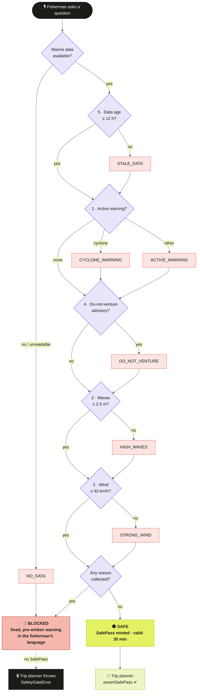

<details>
<summary><b>🔍 The SafePass, in code</b></summary>

```ts
// packages/core/src/safetyGate.ts
export const DEFAULT_THRESHOLDS = Object.freeze({
  maxWaveHeightM: 2.5,    // small-craft limit
  maxWindSpeedKmph: 40,   // IMD advises staying ashore at 40–50 km/h
  maxDataAgeHours: 12,    // older data cannot be trusted
});

// Every fishing-related function must call this first.
export function assertSafePass(pass: unknown, now = new Date()): asserts pass is SafePass {
  if (typeof pass !== 'object' || pass === null || !minted.has(pass as SafePass)) {
    throw new SafetyGateError('Fishing advice requires a SafePass issued by the Safety Gate.');
  }
  if (now.getTime() > Date.parse((pass as SafePass).expiresAt)) {
    throw new SafetyGateError('SafePass expired — re-run the Safety Gate.');
  }
}
```

A SafePass can only be created inside `evaluateSafety()` (it is tracked in a private `WeakSet`), so a forged object never unlocks the trip planner.

</details>

### 📊 The demo scenarios against the gate limits

The bundled Nagapattinam demo ships three sea states. Bars are the conditions and the line is the gate limit. Anything above the line is blocked.

<table>
<tr>
<td width="50%">

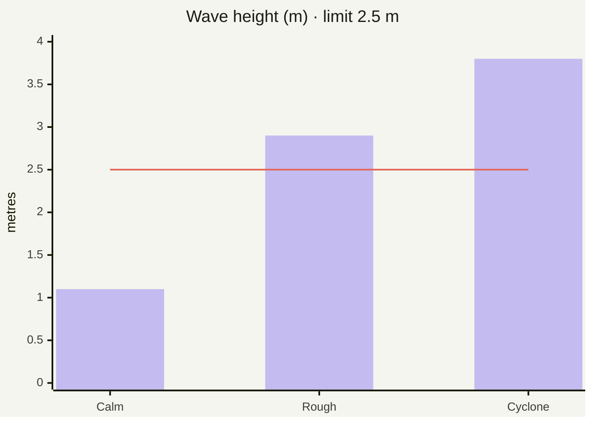

</td>
<td width="50%">

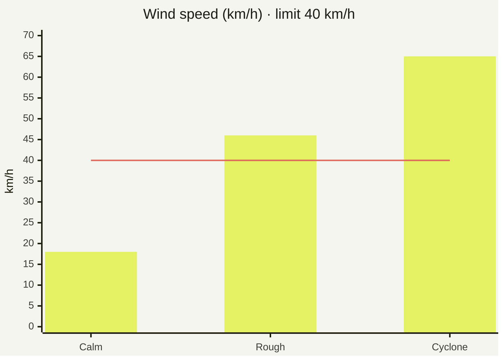

</td>
</tr>
</table>

| Scenario | Waves | Wind | Warning | Gate result |
|---|---|---|---|---|
| 🟢 **Calm day** | 1.1 m | 18 km/h | none | **SAFE**: trip plan + return reminder |
| 🟠 **Rough day** | 2.9 m | 46 km/h | none | **BLOCKED**: `HIGH_WAVES`, `STRONG_WIND` |
| 🔴 **Cyclone day** | 3.8 m | 65 km/h | IMD cyclone, do-not-venture | **BLOCKED**: `CYCLONE_WARNING`, `DO_NOT_VENTURE`, `HIGH_WAVES`, `STRONG_WIND` |


## ✨ Features

<table>
<tr>
<td width="33%" valign="top">

#### 🎙️ Voice-first
Hold the big button and ask. **On-device whisper.cpp** (`whisper.rn`) turns speech into text offline. ORCA replies aloud with recorded clips or the phone's own text-to-speech.

</td>
<td width="33%" valign="top">

#### 📴 Offline-first
Bundled data and on-device logic. It works in airplane mode, and **the age of the data is always on screen**.

</td>
<td width="33%" valign="top">

#### 🆘 One-tap SOS
A 10-second cancel window, then the SOS is queued with the **last 6 hours of trail**. SMS opens, and the queue flushes itself when signal returns.

</td>
</tr>
<tr>
<td valign="top">

#### 🚩 Border alarm
A full-screen siren, vibration and a spoken **"turn back"** near the India–Sri Lanka IMBL. It repeats until "I'm turning back" is tapped.

</td>
<td valign="top">

#### 🧭 Trip planner
Built on Turf.js: **distance, direction, diesel, and a return-by time** before dark (sunset from `suncalc`).

</td>
<td valign="top">

#### ⏰ Return reminders
Two local notifications, one 30 minutes before and one at the return time. It is spoken aloud if the app is open.

</td>
</tr>
<tr>
<td valign="top">

#### 🗣️ 9 languages
தமிழ் · తెలుగు · മലയാളം · বাংলা · ଓଡ଼ିଆ · मराठी · ಕನ್ನಡ · हिन्दी · English, with **code-mixed speech** understood.

</td>
<td valign="top">

#### 🖥️ ORCA Command
An officer dashboard with a live fleet map, IMBL and zones, SOS dispatch, per-boat SMS, and **broadcasts in 9 languages**.

</td>
<td valign="top">

#### 🔐 OTP login
Twilio Verify OTP login, with a dev code of `123456` for demos. The officer role is allow-listed.

</td>
</tr>
</table>

<div align="center">

</div>


## 🏗️ Architecture

One shared brain, **`@orca/core`**, runs **identically on the phone (offline) and on the server**. The phone never needs the server to make a safety decision.

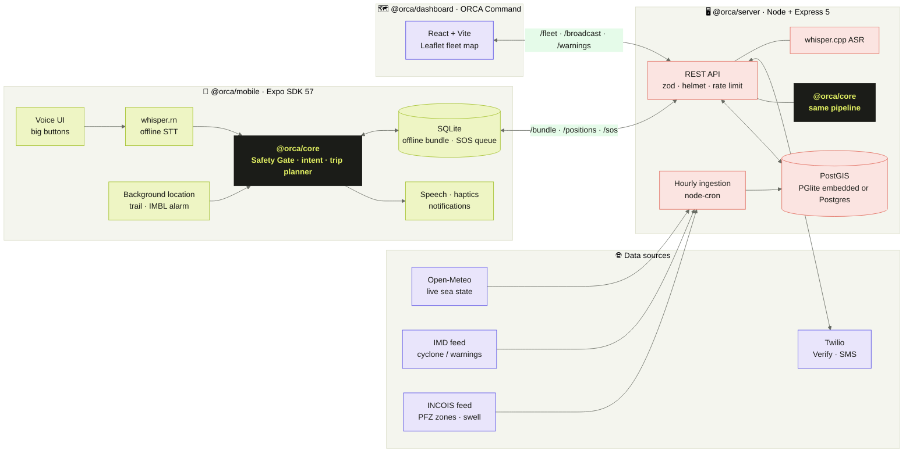


## 🔄 How it flows

### 1 · Asking a question (fully on the phone)

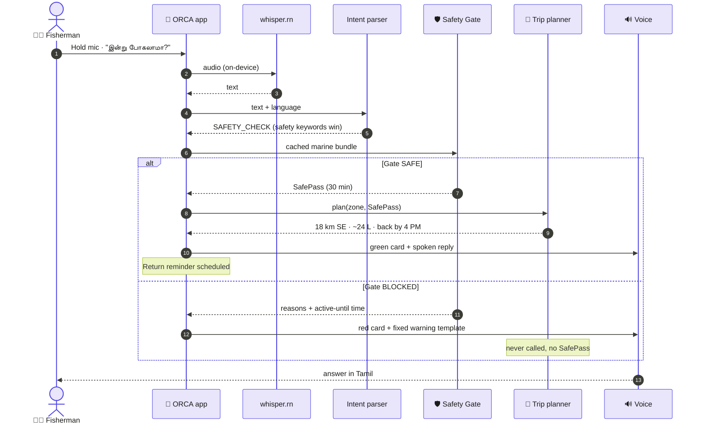

### 2 · Understanding the question

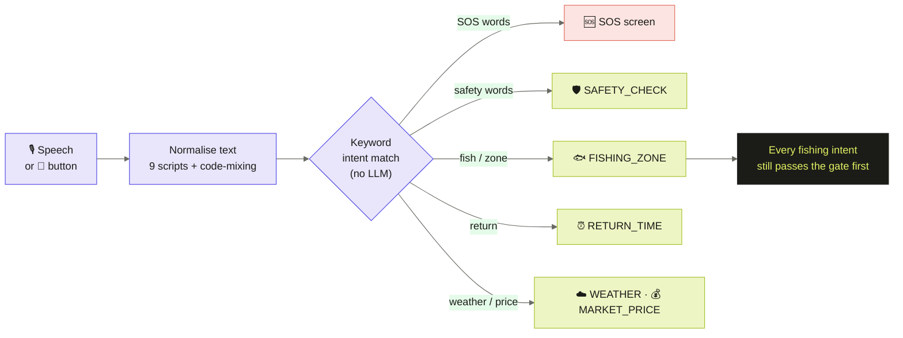

> Over-triggering is acceptable, a miss is not. **Safety keywords always override fishing keywords.**

### 3 · Live data ingestion

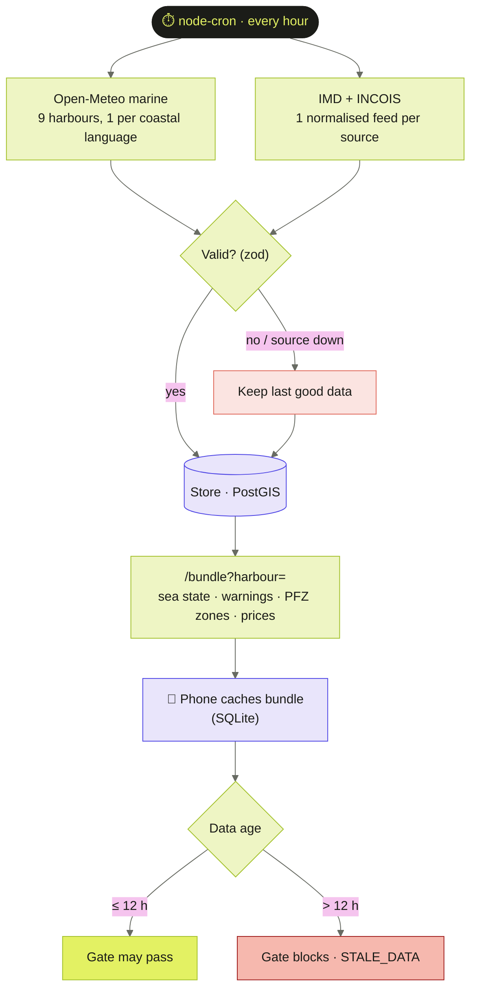

### 4 · SOS: never rejected, never lost

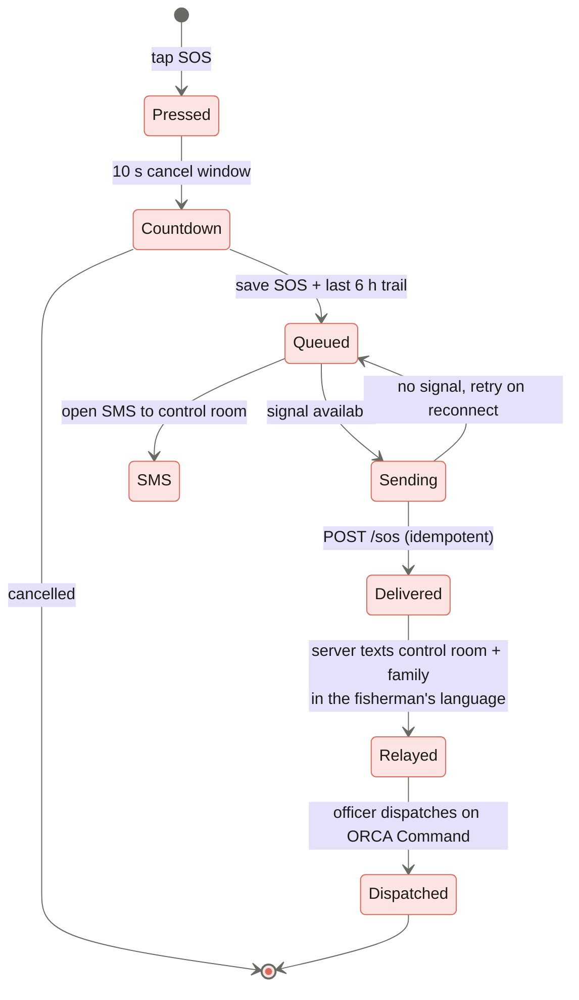

### 5 · Border alarm (IMBL)

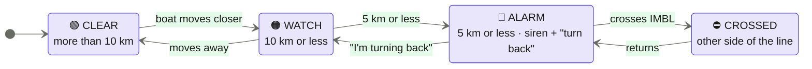

> ⚠️ The IMBL coordinates in [`packages/core/src/imbl.ts`](packages/core/src/imbl.ts) come from the published 1974/1976 agreements. Replace them with the official Survey of India / Coast Guard dataset before real use.

### 6 · Officer broadcast reaches every Safety Gate

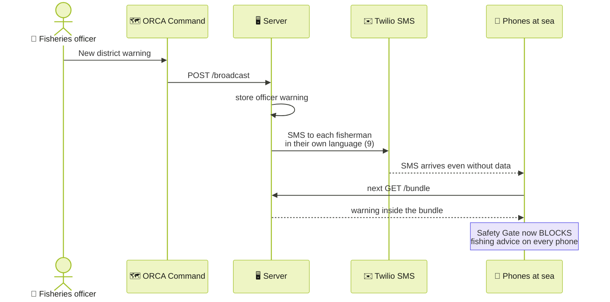

### 7 · A fishing day with ORCA

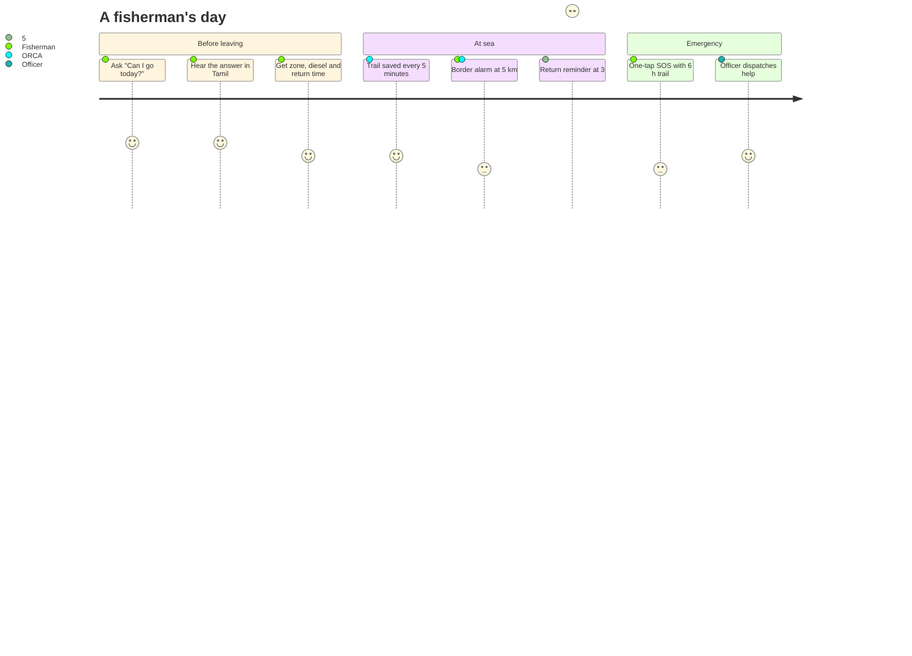


## 🧰 Tech stack

<div align="center">


</div>

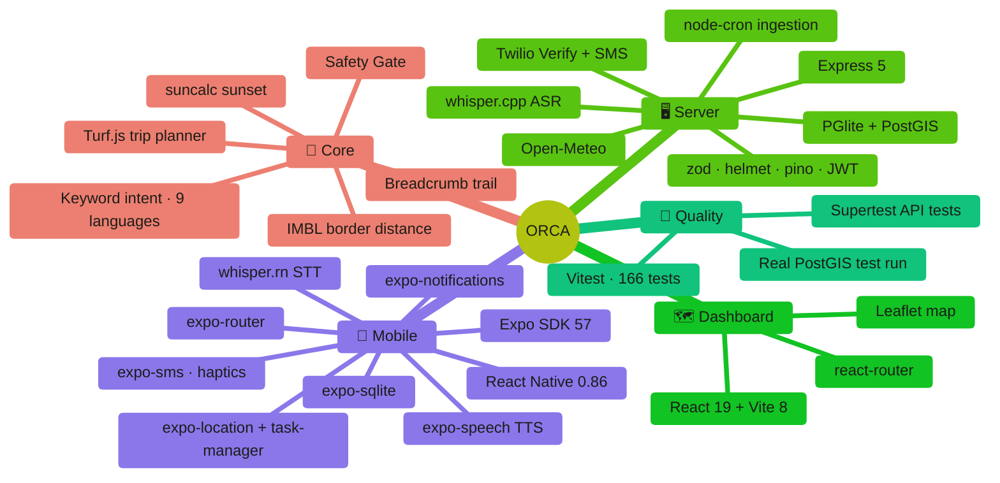

| Layer | Package | What it uses |
|---|---|---|
| 🧠 **Shared brain** | `@orca/core` | TypeScript, Turf.js (`distance`, `bearing`, `point-to-line-distance`, `nearest-point-on-line`), `suncalc`, fixed i18n templates |
| 📱 **Mobile** | `@orca/mobile` | Expo SDK 57, React Native 0.86, React 19, expo-router, whisper.rn, expo-speech / audio, SQLite, location, task-manager, notifications, SMS, haptics, SVG |
| 🖥️ **Server** | `@orca/server` | Node, Express 5, PGlite + PostGIS (or Postgres via `pg`), node-cron, zod, helmet, express-rate-limit, JWT, multer, pino |
| 🗺️ **Dashboard** | `@orca/dashboard` | React 19, Vite 8, Leaflet + react-leaflet, react-router |
| 🔊 **Voice tools** | `tools/voice` | Python, AI4Bharat IndicTTS, or native-speaker WAV recordings |
| 🧪 **Testing** | all | Vitest, Supertest, embedded PostGIS integration run |


## 📈 By the numbers

<table>
<tr>
<td width="50%">

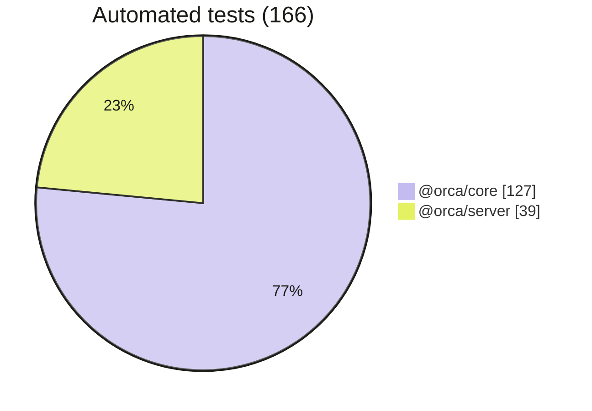

</td>
<td width="50%">

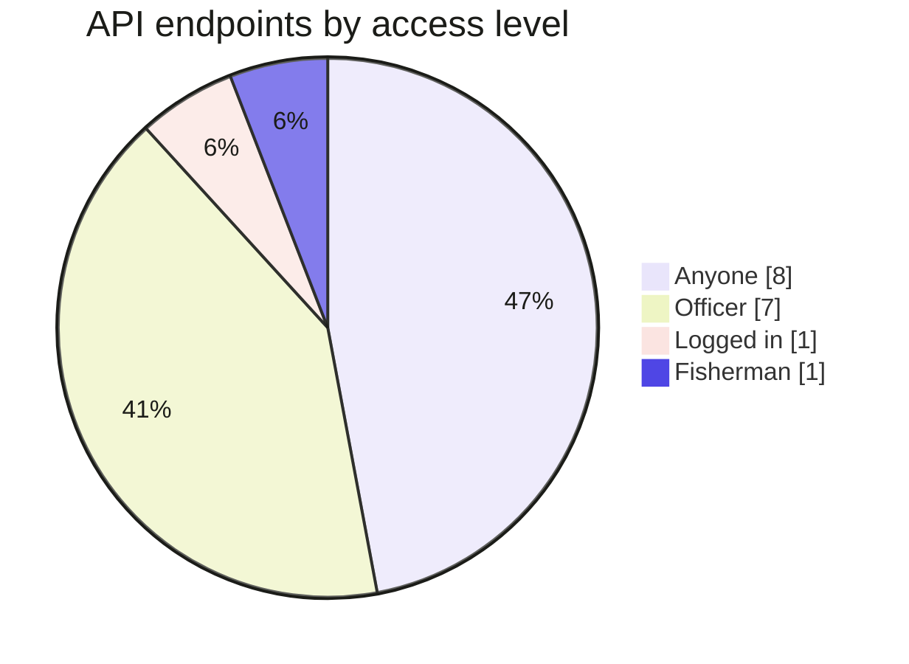

</td>
</tr>
</table>


## 📁 Repository layout

```
📦 orca
├── 📂 packages/core        @orca/core: the shared brain (runs on phone AND server)
│   ├── src/safetyGate.ts   5 checks, fails closed, mints an unforgeable SafePass
│   ├── src/intent.ts       keyword intent, 9 languages + code-mixing, no LLM
│   ├── src/tripPlanner.ts  Turf.js: distance, direction, diesel, return-by time
│   ├── src/copilot.ts      question → gate → fixed-template answer
│   ├── src/i18n/           fixed, pre-written templates: ta te ml bn or mr kn hi en
│   ├── src/imbl.ts         India–Sri Lanka border distance + side-of-line check
│   ├── src/trail.ts        breadcrumb trail (1 point / 5 min, last 6 h)
│   └── test/               127 tests, incl. "fishing fn never called during a warning"
├── 📂 apps/mobile          @orca/mobile: Expo SDK 57 / React Native app (fisherman + officer)
├── 📂 apps/server          @orca/server: Node + Express + PostGIS: ingestion, OTP, SOS relay, fleet, ASR
├── 📂 apps/dashboard       @orca/dashboard: ORCA Command, React + Vite + Leaflet officer dashboard
├── 📂 tools/voice          render fixed safety sentences to clips (IndicTTS or native-speaker recordings)
└── 📂 docs/BUILD.md        building the Android APK with EAS
```


## 🚀 Quick start

```bash
npm install            # from the repo root (npm workspaces)
npm test               # 127 core + 39 server tests
npm run test:db        # server store against real PostGIS (embedded, ~40 s)
npm run test:gate      # just the Safety Gate proof. Show this to the jury.
npm run mobile         # start Expo; scan the QR code with Expo Go (SDK 57)
npm run server         # API on :4000. Embedded PostGIS, live Open-Meteo sea state
npm run dashboard      # officer dashboard on :5173 (set VITE_API_URL if the API is not on :4000)
```

> [!TIP]
> **Officer dashboard login:** any number (dev mode), OTP `123456`. Use **Load demo fleet** in the top bar to put 40 simulated boats on the map.

> [!NOTE]
> **Without a server, the app runs in offline demo mode.**
> - The login OTP is `123456`.
> - Data comes from the bundled Nagapattinam scenarios.
> - To use the server, run `npm run server` and set `EXPO_PUBLIC_API_URL=http://<your-PC-IP>:4000` in `apps/mobile/.env` (see `.env.example`). With the server running, the dev OTP is still `123456` until Twilio is configured.


## 🎬 The 90-second demo

| # | Step | What you see |
|:-:|---|---|
| 1 | **Log in:** pick தமிழ், choose Fisherman, and enter OTP `123456` | Home screen with the big mic |
| 2 | **Ask if it's safe:** tap **"இன்று போகலாமா?"** (can I go today?) | 🟢 Green card and a spoken Tamil reply: 18 km south-east, ~24 L of diesel, start back by 4:00 PM |
| 3 | **Switch to a cyclone day:** ⚙ Settings → Demo scenario → **Cyclone day** | The scenario changes |
| 4 | **Ask again** | 🔴 Red card with the Tamil warning and the end time, *"வியாழன் மாலை 6:00 வரை"* (until Thursday 6:00 PM). The fishing answer doesn't appear, and the Zone Map is locked |
| 5 | **Show the proof:** run `npm run test:gate` | ✅ Every test passes |
| 6 | **Go offline:** turn on airplane mode and ask again | It still answers, and the data age stays visible |
| 7 | **Send an SOS** | A 10-second cancel window, then the SOS is queued with the last 6 h of trail, SMS opens, and the queue flushes when signal returns |
| 8 | **Border alarm:** ⚙ Settings → Demo boat position → **Near border** | A full-screen red alarm, siren, vibration and a spoken "turn back" until "I'm turning back" is tapped. **Across border** shows the crossed message |
| 9 | **Return reminder:** after a green answer | "Return reminder set for 4:00 PM", with 2 local notifications (30 min before, and at the time) |


## 🗓️ Build phases

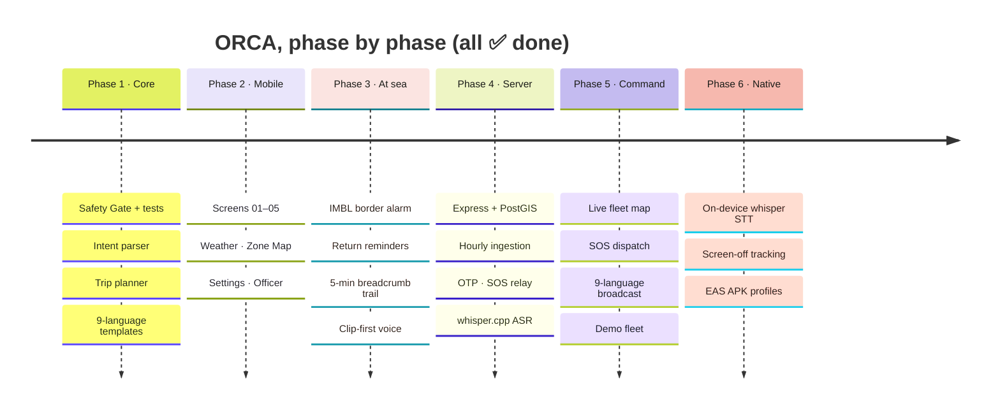

| Phase | Scope | Status |
|:-:|---|:-:|
| 1 | Core: Safety Gate and tests, intent, trip planner, 9-language templates | ✅ |
| 2 | Mobile screens 01–05, plus Weather, Zone Map, Settings and Officer | ✅ |
| 3 | IMBL border alarm, return reminder notifications, 5-minute breadcrumb trail, clip-first voice pipeline | ✅ |
| 4 | Server: Express + PostGIS (embedded PGlite or Postgres), hourly ingestion (live Open-Meteo sea state, IMD/INCOIS feeds), OTP, SOS relay with family SMS, fleet and officer warnings, whisper.cpp ASR | ✅ |
| 5 | Officer dashboard (screens 06–07): live fleet map with IMBL and zones, stat cards, alert feed, SOS dispatch, per-boat SMS, 9-language broadcast that enters every Safety Gate, demo fleet | ✅ |
| 6 | Native build: on-device whisper.cpp speech-to-text (whisper.rn, one-time 57 MB model), screen-off tracking with background border alerts, EAS APK profiles | ✅ (see [`docs/BUILD.md`](docs/BUILD.md)) |


## 📦 Building the APK

This PC has no Android SDK, so the APK is built in the cloud with **EAS**. Log in once, then run one command. The full steps are in [`docs/BUILD.md`](docs/BUILD.md). Expo Go still runs everything except offline speech-to-text and tracking with the screen off.

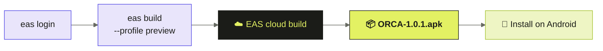


## 🔌 Server API

| Endpoint | Who | What |
|---|:-:|---|
| `GET /health` | 🌐 anyone | store, OTP/SMS/ASR mode, last ingestion |
| `GET /harbours`, `GET /bundle?harbour=` | 🌐 anyone | offline bundle: live sea state + warnings + PFZ zones + prices |
| `POST /auth/otp`, `POST /auth/verify` | 🌐 anyone | OTP login (Twilio Verify, dev code `123456`); officer role is allow-listed |
| `GET/PATCH /me` | 🔑 logged in | language, harbour, family contact |
| `POST /sos` | 🌐 **anyone** | never rejected, idempotent; texts the control room and the family (in the fisherman's language) |
| `POST /positions` | 🧑‍✈️ fisherman | breadcrumb upload → fleet map |
| `POST /asr` | 🌐 anyone | audio → text via whisper.cpp (503 → phone uses buttons) |
| `POST /ask` | 🌐 anyone | same core pipeline server-side (for IVR/SMS channels) |
| `GET /fleet`, `GET/PATCH /sos` | 👮 officer | boats at sea, border status, return ETA, SOS dispatch |
| `POST /broadcast`, `POST /notify` | 👮 officer | district warning (gate + SMS in each fisherman's language); text one boat |
| `GET/POST/DELETE /warnings` | 👮 officer | an officer warning enters every phone's Safety Gate |
| `POST /demo/scenario`, `POST /ingest/run` | 👮 officer | stage "date badlo", run ingestion now |

Sea state comes live from **Open-Meteo** every hour for 9 harbours, one per coastal language. IMD and INCOIS don't publish stable JSON APIs, so the server accepts one normalised feed per source; the shapes are documented in [`apps/server/src/ingest/feeds.ts`](apps/server/src/ingest/feeds.ts). If a source fails, the last good data is kept. The phone shows how old the data is, and its Safety Gate blocks once the data is 12 hours old.


## 🧭 Safety principles (from the brief)

| | Principle | How ORCA does it |
|:-:|---|---|
| 🤖 | **No AI in the safety decision** | Plain `if/else` logic, deterministic and testable |
| 🔒 | **Fails closed** | Missing, unreadable or stale (older than 12 h) data blocks the fishing answer |
| 📝 | **No machine translation for safety text** | Fixed, pre-written templates in every language; native-speaker review is tracked in [`packages/core/TRANSLATIONS.md`](packages/core/TRANSLATIONS.md) |
| 📢 | **Over-triggering is acceptable, a miss is not** | Safety keywords override fishing keywords |
| ⏱️ | **The data's age is always visible** | Shown on every screen, and it turns red once it is too old to trust |
| 🗺️ | **The border line is approximate** | IMBL from the 1974/1976 agreements; swap in the official Survey of India / Coast Guard dataset before real use |


## 🔊 Voice clips

Fixed safety sentences (`VOICE_KEYS` in core) play from recorded clips when they exist. Anything else, and any sentence without a clip, uses the phone's own text-to-speech.

```bash
npm run voice:export                                                  # write tools/voice/texts.json
python tools/voice/render_clips.py --models <IndicTTS checkpoints>    # render with AI4Bharat IndicTTS
npm run voice:manifest                                                # or: drop native-speaker WAVs in apps/mobile/assets/voice/<lang>/<key>.wav
```

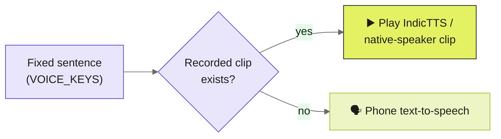


## 🙏 Acknowledgements

[IMD](https://mausam.imd.gov.in) and [INCOIS](https://incois.gov.in) for marine warnings and PFZ advisories · [Open-Meteo](https://open-meteo.com) for live sea state · [whisper.cpp](https://github.com/ggerganov/whisper.cpp) and [whisper.rn](https://github.com/mybigday/whisper.rn) for offline speech · [AI4Bharat IndicTTS](https://github.com/AI4Bharat/Indic-TTS) for Indian-language voices · [Turf.js](https://turfjs.org) for geospatial maths.

<br/>

<div align="center">

<a href="https://orca-app-gold.vercel.app/ORCA-1.0.1.apk"></a>

<sub>Made for <b>Smart India Hackathon 2026</b> · Problem Statement <b>SIH26176</b></sub>

</div>
